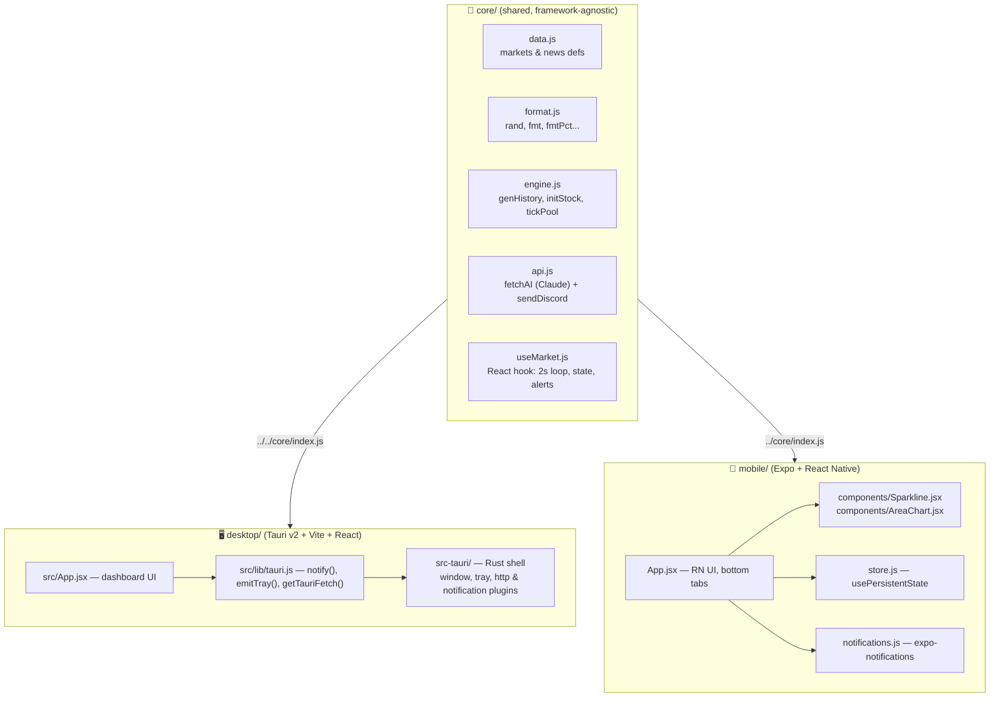
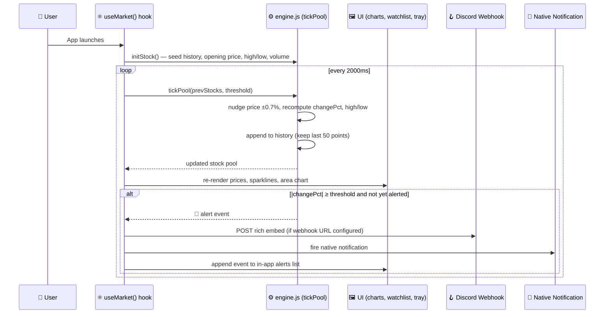

# 📈 NSE Market Hub

A real-time market dashboard for the **Nairobi Securities Exchange (NSE)** and related East-African / global markets — shipped as **two native apps from one shared codebase** 🧠

| 🖥️ Desktop | 📱 Mobile |
|---|---|
| Tauri v2 + Vite + React | React Native + Expo |
| Windows / macOS / Linux | iOS / Android |

Both apps render the **same live market simulation**, watchlists, portfolios, news, and AI-generated reports — all driven by a single shared engine living in `core/`.

> ⚠️ **Heads up:** market data is **simulated** using a random-walk price generator. There's no live feed wired in yet — everything you see (prices, charts, alerts) is produced locally, so you can build and demo the full UI/notification/persistence stack without needing a real data provider.

---

## ✨ Features

| Feature | 🖥️ Desktop | 📱 Mobile |
|---|:---:|:---:|
| ⏱️ Live ticking prices (every 2s) for 4 markets | ✅ | ✅ |
| 🌍 NSE / NEROB / East-Africa / Global tabs | ✅ | ✅ |
| 📊 Sparklines + area detail chart | ✅ | ✅ (`react-native-svg`) |
| ⭐ Watchlist | ✅ | ✅ |
| 💼 Portfolio tracker (P&L) | ✅ | ✅ |
| 📰 News feed (filterable) | ✅ | ✅ |
| 🚨 Threshold alerts (±%) | ✅ | ✅ |
| 🔔 Native notifications on breach | ✅ (Tauri plugin) | ✅ (`expo-notifications`) |
| 🪝 Discord webhook on breach | ✅ | ✅ |
| 🖱️ System tray with live top-mover % | ✅ | — |
| 💾 Persistent settings/portfolio | ✅ (`localStorage`) | ✅ (`async-storage`) |
| 🤖 AI Market Report + Tips (Claude) | ✅ | ✅ |

---

## 🏗️ Architecture

Everything that isn't UI or native-platform glue lives in a single **framework-agnostic core**, imported by both apps via a relative path.



**The only app-specific code is the rendering layer and native platform integrations** — all market logic, formatting, and API transport lives in `core/`.

---

## 🔄 How the Engine Works (data flow)



**Key behaviors:**
- 🌱 **Initialization** — `initStock()` seeds each company with a random history (`genHistory`) and computes its opening price, change, high/low, and volume.
- ⏲️ **Live loop** — `useMarket()` runs a `setInterval` every 2000 ms, calling `tickPool()` for each of the 4 markets.
- 🚨 **Alerts** — when a move crosses the configured threshold, the app fires a Discord webhook, a native notification, and logs the event in-app.
- 🔍 **Selected stock** — the detail panel re-syncs to the live object every tick, so the area chart animates in real time.
- 💾 Threshold, watchlist, portfolio, webhook URL, and API key are all **persisted**, so they survive restarts.

---

## 📁 Project Layout

```
market viwer/
├─ core/            🧠 shared engine (data, format, engine, api, useMarket)
├─ desktop/         🖥️ Tauri + Vite + React   → npm run tauri dev / build
└─ mobile/          📱 Expo + React Native    → npx expo start / eas build
```

---

## 🖥️ Desktop (Tauri v2)

### Prerequisites
- 🦀 Rust + the [Tauri v2 prerequisites](https://tauri.app) for your OS (WebView2 on Windows, Xcode CLT on macOS, webkit2gtk on Linux)
- 🟢 Node.js ≥ 18

### Run
```bash
cd desktop
npm install
npm run tauri dev      # launches the native window + Vite dev server
```

### Build distributables
```bash
npm run tauri build    # outputs:
                        #   Windows → .msi / .exe
                        #   macOS   → .app / .dmg  (signing needed on a Mac)
                        #   Linux   → .deb / .AppImage
```

### 🔌 Native integrations
| Integration | Details |
|---|---|
| 🔔 Notifications | `src/lib/tauri.js → notify()` uses `@tauri-apps/plugin-notification`. Permission granted in `src-tauri/capabilities/default.json`. |
| 🖱️ System tray | `src-tauri/src/lib.rs` builds a tray icon; every 5s the UI calls `emitTray()` → Rust `update_tray` command shows the top NSE mover's %. |
| 🌐 CORS-free HTTP | `core/api.js` accepts a `fetchImpl`. On desktop, `getTauriFetch()` injects `@tauri-apps/plugin-http`'s fetch, exempt from browser CORS. Scopes declared in `src-tauri/tauri.conf.json → plugins.http.scope`. |
| 💾 Persistence | `localStorage` (survives restarts inside the webview). |

---

## 📱 Mobile (Expo)

### Prerequisites
- 🟢 Node.js ≥ 18
- Expo CLI (`npm i -g expo-cli`) — or just use `npx expo`
- For device builds: Android Studio (Android) or Xcode (iOS)

### Run in Expo Go / emulator
```bash
cd mobile
npm install
npx expo start          # scan the QR code with Expo Go, or press a / i
```

### Build a native installer
```bash
npx expo prebuild        # generates native android/ & ios/ projects
npx expo run:android     # builds & installs on a connected device/emulator

# or use EAS for cloud builds:
eas build --platform android    # → .apk / .aab
eas build --platform ios        # → .ipa
```

### 🔌 Native integrations
| Integration | Details |
|---|---|
| 📊 Charts | `react-native-svg` (`components/Sparkline.jsx`, `components/AreaChart.jsx`) |
| 💾 Persistence | `@react-native-async-storage/async-storage` via `store.js → usePersistentState` |
| 🔔 Notifications | `expo-notifications` (`notifications.js → notify()`) |
| 🎨 UI | Built from `View` / `Text` / `ScrollView` / `TouchableOpacity` + `StyleSheet`, with a bottom tab bar (Markets / Watch / Portfolio / News / AI) |

---

## ⚙️ Configuration (both apps)

Open **Settings** (⚙ on desktop header / mobile top-right):

| Setting | Purpose |
|---|---|
| 🪝 **Discord Webhook URL** | Stock alerts are POSTed here as rich embeds |
| 🔑 **Anthropic API Key** | Enables the AI Market Report & Tips — get one at [console.anthropic.com](https://console.anthropic.com) |
| 🎚️ **Alert Threshold (%)** | e.g. `2.5` → notify when a stock moves ±2.5% |

All three are persisted **locally** and never leave the device except to call Discord/Anthropic directly.

---

## 🤖 AI Reports & CORS

- 🖥️ **Desktop** uses Tauri's HTTP plugin, so the Claude API call bypasses CORS and works out of the box once you supply an API key.
- 📱 **Mobile** uses standard `fetch`, which may be blocked by CORS when calling `api.anthropic.com` directly from a device. If reports fail on mobile, point `fetchAI` at a small proxy (the `proxyUrl` option is already wired in `core/api.js`):

```js
fetchAI(prompt, apiKey, { proxyUrl: "https://your-proxy.example.com/anthropic" });
```

The proxy should forward the request server-side with your key.

> 💡 If no API key is set, the report/tips screens show a friendly "add your API key" message instead of crashing.

---

## 🚧 Known Limitations / Next Steps

- 📡 Market data is **simulated** — wire a real feed (e.g. NSE API / a broker) into `core/engine.js` (`tickPool`) to go live.
- 🦀 Desktop Rust shell was not compiled in the original build environment (policy-limited); build it with `npm run tauri build` on a machine with Rust.
- 🔄 Mobile background price updates need a fetch task (e.g. `expo-background-fetch`) if you want alerts while the app is closed.
- 🔐 No authentication / multi-user support yet.

---

<p align="center">Built with ⚛️ React · 🦀 Rust · 📱 Expo · 🤖 Claude</p>
